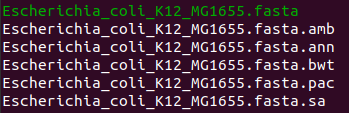
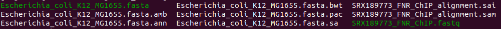
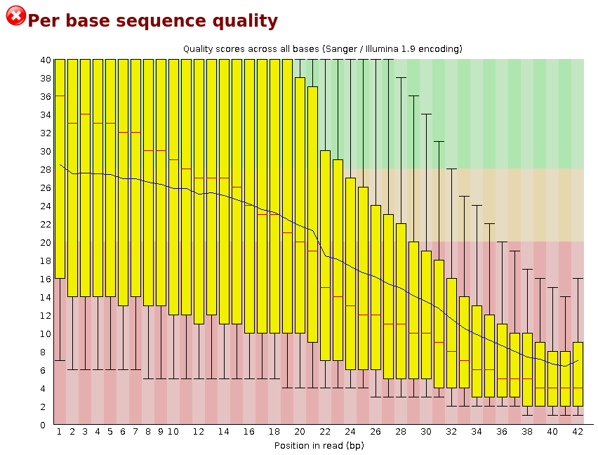
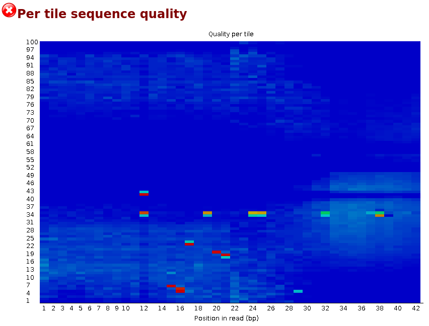
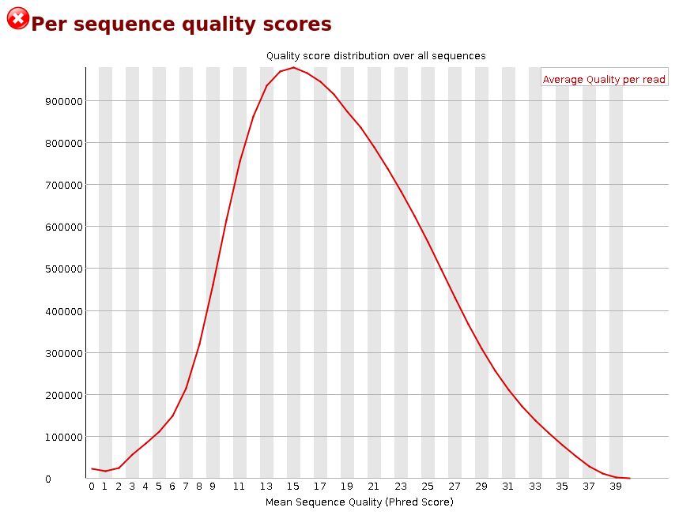

Mis cambios en RStudio
Cambios de Rodrigo

# Practical alignment


## Using bwa index of e.coli genome align reads from a FNR ChIP-seq experiment:

Burrows-Wheeler Alignment (BWA) is a mapping software of low divergence samples to a reference genome. Before do alignment we need the reference genome indexed, because with this structure we get a faster localization and access to the data. Thus we run:

```{bash eval=FALSE}
bwa index Escherichia_coli_K12_MG1655.fasta
```
The bwa command can index the unzipped .fasta file.

to obtain five new files, that bwa will use:

<div>
  {width = 1000}

Then, we want to obtain the promoters sequences of FNR by ChIP-seq in order to align and obtain their positions. The Fumarate Nitrate Reduction (FNR) is a transcriptional regulator of the transition between aerobic and anaerobic growth of bacterias like Escherichia coli (E. Coli).

The command to perform the alignment is bwa aln:

```{bash eval=FALSE }
bwa aln Escherichia_coli_K12_MG1655.fasta SRX189773_FNR_ChIP.fastq > SRX189773_FNR_ChIP_alignment.sai
```
  
`aln` is a command that invokes different algorithms for the alignment, for this we input the reference genome at first, the results of the ChIP-seq experiment, and we put the name of the .sai file, that is an intermediate file containing the suffix array coordinate of all short reads loaded in. 

The .sai file from the bwa aln step is in a binary format. bwa samse command helps us to create a human-readable format.

```{bash eval=FALSE}
bwa samse Escherichia_coli_K12_MG1655.fasta SRX189773_FNR_ChIP_alignment.sai SRX189773_FNR_ChIP.fastq > SRX189773_FNR_ChIP_alignment.sam
```
  
We give to the command the genome reference file .fasta, the .sai file and the sequencing results .fastq. The output will be a .sam file. 

Finally we got all these files:
<div>
{width=700px}
  


## Align reads from a FNR ChIP-seq experiment:

We use this code to obtain a fastqc and analyze the quality of the data before the alignment:

```{bash eval=FALSE}
fastqc Escherichia_coli_K12_MG1655.fastq.gz
```
{width=500px}
In the summary we have the main information of our reads and we can observe that they don´t accomplish five of the requirements

{width=500px}
In the case of the per base sequence quiality que can observe a low quality along all the positions 
  
{width=500px}
In the graphic per tile sequence quality se see that some interference ocurred in the lines, so that was enough to mark it with a low quality    
 
{width=500px}
Here we can´t see a good quality in the mayority of the reads 
  
All the others statistics information seem to be good enough
  
If we would like to improve the quality we can use the next code: 
  
  
## Using the available indexed genomes in the cluster (/mnt/Archives/genome/) align reads of a mouse ChIP-seq experiment to the genome.

bioinfoII/data/alignment
